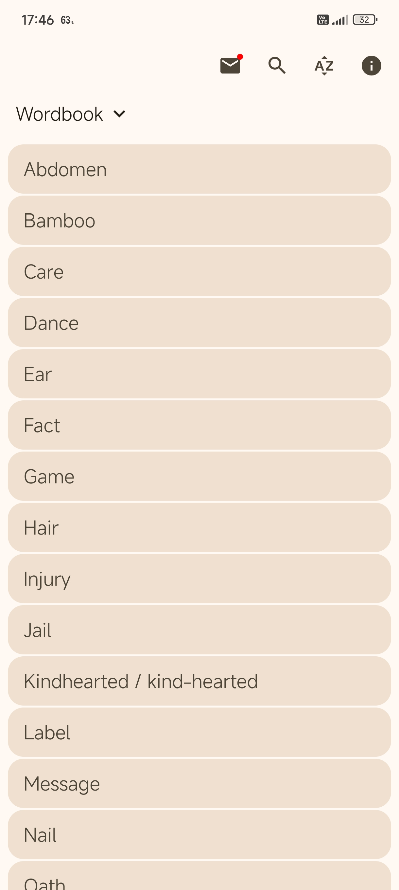
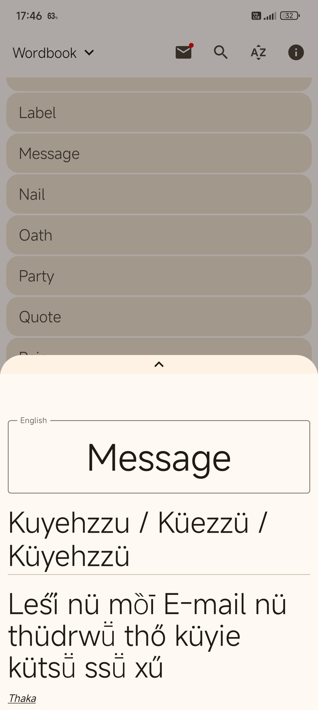
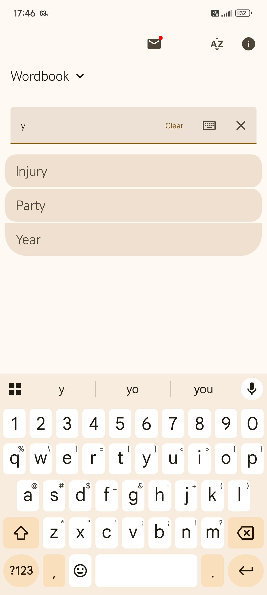
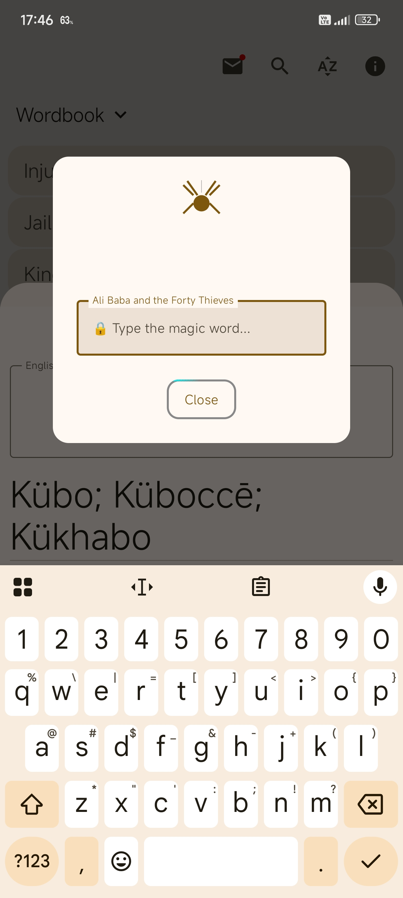
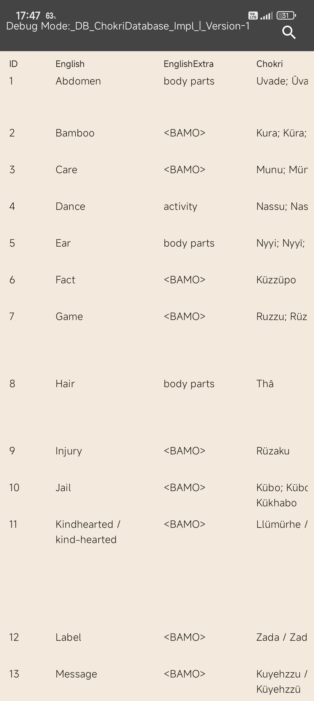
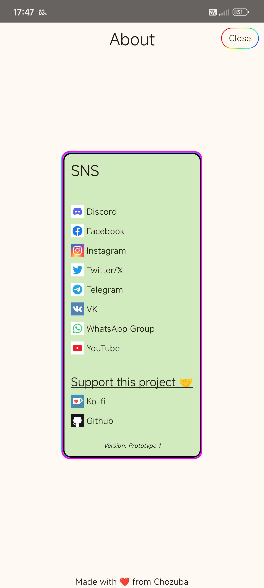

<p align="center">
  <a href="https://github.com/fenxe/ChokriWordbook/releases/latest">
    
  </a>
  <a href="https://android-arsenal.com/api?level=30">
    
  </a>
  <a href="https://android.com/">
    
  </a>
</p>

# 🌞 ChokriWordbook - Dictionary Concept App
### A simple mockup app based on compose to show word and it's equivalent meaning, there maybe lots of caveat here and there.
> *This is an experiment, however issues or pull request are clearly welcomed and opened as long as possible*

<p align="center">
  Download from 
  <a href="https://github.com/fenxe/ChokriWordbook/releases/latest">
    
  </a>
  or checkout the 
  <a href="https://github.com/fenxe/ChokriWordbook/releases">releases tab</a>
</p>

------
### Cloning:

🚀 **Clone the Repository**

Compiled from latest Android Studio, you might also need Android Studio Narwhal 2025.1.2 to avoid running into unexpected errors

*To get started, clone the repository using Git:*

```bash
$ git clone https://github.com/fenxe/ChokriWordbook.git
$ cd ChokriWordbook
$ git checkout barebone
```


------
*(images may vary with the actual app!)*
<div align="center">






</div>

***++Some features during testing++***

| Feature | Description | Android (Tested) |
| :-----------: | :-----------: | :-----------: |
| Main app | Full screen interface including search, word page and some junk animation | ✅Android 15 and 16 |
| About page | [Under Construction] Pages that shows social links connected to apps, currently GitHub link is available | ✅No issues on Android 15 and 16 |
| [Debug page]() | Whole dictionary screen page where you can verify or to correct an incorrect word (Currently limited to read-only mode, guess the magic word magic 🪄) | ✅ Rendering correctly Android 15/16 |


**Library used**:  
[Android compose](https://developer.android.com/compose)  
[Room](https://developer.android.com/jetpack/androidx/releases/room)  
[Kotlinx Json Serialization](https://github.com/Kotlin/kotlinx.serialization)

**Useful references**:  
[Compose samples](https://github.com/android/compose-samples)  
[Room with a view](https://developer.android.com/codelabs/android-room-with-a-view-kotlin)  
[Material3 guidelines by BOLTUIX](https://github.com/boltuix-store/Material-Design-Components)
